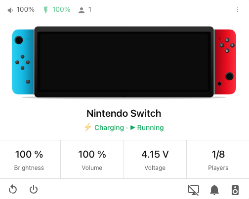

# Nintendo Switch Card

<p align="center">
  
</p>

Lovelace card for Home Assistant that displays Nintendo Switch state. Reads MQTT entities published by [switch-assistant](https://github.com/ErSeraph/switch-assistant).

## Features

- Header badges: volume, battery (with pulse animation when charging, red flash when low), connected players
- Inline SVG of the Nintendo Switch (Joy-Cons Neon Blue/Red)
- Dynamic state line: `Standby` / `▶ <game>` / `⚡ Charging · <charger_type>` / `Unavailable`
- 4-stat grid (default: brightness · volume · voltage · players)
- Action toolbar (reboot · shutdown · notify · screen status · audio target)
- i18n: English and Brazilian Portuguese
- Fully accessible (`role`, `aria-label`, `aria-live`, `prefers-reduced-motion`)

## Installation

### HACS (recommended)

1. In HACS, add this repository as a custom repository (category: Plugin)
2. Install "Nintendo Switch Card"
3. Reload your dashboard

### Manual

1. Download `nintendo-switch-card.js` from the latest [release](https://github.com/hudsonbrendon/nintendo-switch-card/releases)
2. Copy to `/config/www/`
3. Add the resource in **Settings → Dashboards → Resources**:
   - URL: `/local/nintendo-switch-card.js`
   - Type: `JavaScript Module`

## Configuration

Minimum configuration:

```yaml
type: custom:nintendo-switch-card
entity: nintendo_switch
```

The `entity` field is the device prefix used by switch-assistant. The card auto-resolves entity IDs as `sensor.<prefix>_<suffix>` (or `binary_sensor.<prefix>_<suffix>` for `is_charging` and `game_running`).

### Full options

```yaml
type: custom:nintendo-switch-card
entity: nintendo_switch
name: My Switch
image: switch-default            # or absolute URL / /local/path
compact: false
language: pt-BR                  # default: hass.locale.language
entities:
  battery_level: sensor.foo_battery_level
  is_charging: binary_sensor.foo_is_charging
  # ... see full list in design doc
stats:
  - entity: sensor.nintendo_switch_screen_brightness
    unit: "%"
    subtitle: stat.brightness    # i18n key or literal
  - entity: sensor.nintendo_switch_volume
    unit: "%"
    subtitle: stat.volume
  - entity: sensor.nintendo_switch_battery_voltage
    unit: V
    multiply: 0.001
    precision: 2
    subtitle: stat.voltage
  - entity: sensor.nintendo_switch_player_count
    suffix: "/8"
    subtitle: stat.players
actions:
  - service: button.press
    service_data: { entity_id: button.nintendo_switch_reboot }
    icon: mdi:restart
    name_key: action.reboot
  - service: button.press
    service_data: { entity_id: button.nintendo_switch_shutdown }
    icon: mdi:power
    name_key: action.shutdown
notify_action:
  service: notify.send_message
  target: { entity_id: notify.nintendo_switch_popup_notification }
```

## Development

```bash
npm install
npm test           # run tests
npm run lint       # eslint
npm run typecheck  # tsc --noEmit
npm run build      # produce dist/nintendo-switch-card.js
npm run watch      # rebuild on change
```

## License

MIT
